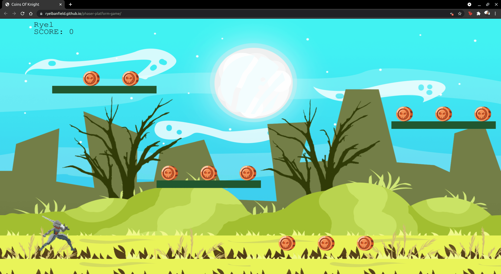

# Phaser Platform Game

[Click here to view live demo](https://ryelbanfield.github.io/phaser-platform-game/)

A platform game built with Phaser JS.

Collect as many coins as you can. Bombs spawn so try to avoid them! Use your arrow keys to move.

Additional description about the project and its features.

View the GGD [here](GDD.md)

## Built With

- JavaScript
- Phaser

## Getting Started

- Download or clone this repo by using `git clone `
- Enter the project folder and run `npm i`.
- To run the tests, run `npm run test`.
- To run the local server, run `npm run start`.

## Author

👤 **Ryel Banfield**

- GitHub: [@RyelBanfield](https://github.com/ryelbanfield)
- Twitter: [@RyelBanfield](https://twitter.com/ryelbanfield)
- LinkedIn: [Ryel Banfield](https://www.linkedin.com/in/ryel-banfield/)

## 🤝 Contributing

Contributions, issues, and feature requests are welcome!

Feel free to check the [issues page](../../issues/).

## Show your support

Give a ⭐️ if you like this project!

## Acknowledgments

- Hat tip to anyone whose code was used
- Inspiration
- etc

## 📝 License

This project is [MIT](LICENSE) licensed.

I’m Not What I Thought by Darren Curtis
Creative Commons Attribution 3.0 Unported License
https://creativecommons.org/licenses/by/3.0/
Music promoted by https://www.chosic.com/
